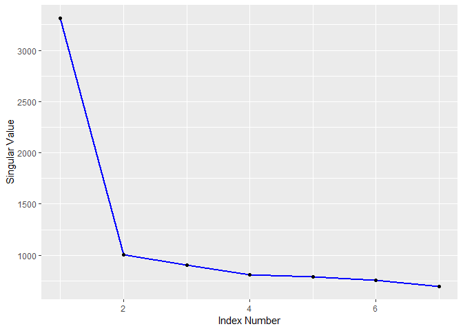
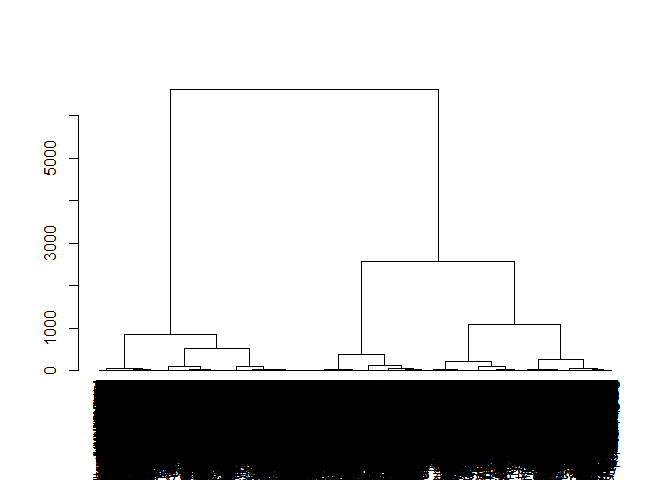

Q1\_Answer
================
dan

Big Data Analytics Assignment (Text Analytics, Natural Language Processing & Sentiment Analytics)
=================================================================================================

Question 1: Term Clustering Using LSA Approach.
-----------------------------------------------

``` r
# Question 1 ##########
# install.packages("tm.corpus.Oz.Books", repos = "http://datacube.wu.ac.at/", type = "source")
library(tm.corpus.Oz.Books)
library(lsa)
library(tm)
library(ggplot2)
library(coop)
library(fpc)

data("Oz_Books")
```

``` r
# Q1a ##########
# Unigram Tokenizer
UnigramTokenizer <- function(x)
    unlist(lapply(ngrams(words(x), 1), paste, collapse = " "), use.names = FALSE)

# Replacment of unwanted characters by blanks
cr.sub <- content_transformer( 
    function(x, pattern, replacement) 
        gsub(pattern, replacement, x))

# save the original version of corpus
oz.p <- Oz_Books
# Remove Carriage Return characters
oz.p <- tm_map(oz.p, cr.sub, "[\n]", " ")
# Remove Punctuation
oz.p <- tm_map(oz.p, removePunctuation)
# Normalize Case
oz.p <- tm_map(oz.p, content_transformer(tolower))
# Remove Stopwords
oz.p <- tm_map(oz.p, removeWords, stopwords("english"))
# Remove Extra Spaces
oz.p <- tm_map(oz.p, stripWhitespace)

tdm <- TermDocumentMatrix(oz.p)

txt_mat <- as.textmatrix(as.matrix(tdm))
lsa_model <- lsa(txt_mat)

dim(lsa_model$tk) # Terms x in LSA Space
```

    ## [1] 19730     7

``` r
dim(lsa_model$dk) # Documents x in LSA Space
```

    ## [1] 21  7

``` r
length(lsa_model$sk) # Singular Values
```

    ## [1] 7

``` r
scree <- data.frame(x=1:length(lsa_model$sk), y=lsa_model$sk)

ggplot(data=scree, aes(x=x, y=y)) +
    geom_line(col="blue", lwd=1) +
    geom_point() +
    xlab("Index Number") + ylab("Singular Value")
```



``` r
kdim <- 1
```

By using Scree plot, optimal dimension of LSA space is 1.

``` r
# Q1b ##########
lsa_model <- lsa(txt_mat, dims=kdim)
# cosine similarities of terms and documents
sim_matrix_lsa <- coop::cosine(t(lsa_model$tk %*% diag(lsa_model$sk)))
# distance matrices of terms and documents
dist_matrix_lsa <- as.dist(acos(pmin(pmax(sim_matrix_lsa,-1.0),1.0)))

# Q1c ##########
oz.clust <- hclust(dist_matrix_lsa, method="ward.D")
dend <- as.dendrogram(oz.clust)
plot(dend)
```



Select the number of clusters with the largest Calinski & Harabasz (CH) value

``` r
y <- lsa_model$tk[,1]
kmax <- 20
ch_indx <- c()
for (j in 2:kmax) {
    memb <- cutree(oz.clust, k=j)
    ch_indx <- c(ch_indx, calinhara(y, memb))
}
kopt <- which.max(ch_indx) + 1
kopt
```

    ## [1] 6

``` r
ch_indx[kopt]
```

    ## [1] 110.3548

Number of Clusters: 6 CH value : 110.3548
